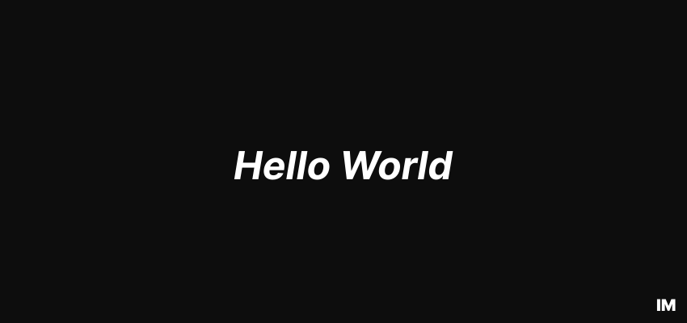

    

    
    &nbsp;—&nbsp;
    
    &nbsp;—&nbsp;
    
    &nbsp;—&nbsp;
    
    &nbsp;—&nbsp;
    

---

<table border="0" style="width: 100%; border-collapse: collapse;">
    <tr>
        <td style="width: 60%; padding: 10px; vertical-align: top;">
            <h2>👋 Hello, I'm mysae!</h2>
            
I am a <b>15-year-old</b> developer and competitive programmer. My main focus is mastering algorithms and data structures using <b>C++</b>. I am actively training on <b>Codeforces</b> to reach the <b>international level</b>.

             
            
Beyond the world of algorithms, I have a deep passion for game development. Currently, I'm working on an atmospheric <b>Horror Game</b> built with the <b>Godot Engine</b>. I love the challenge of combining technical complexity with dark, immersive storytelling.

             
            
In my spare time, you'll find me building in <b>Minecraft</b> or analyzing the deep lore of <b>FNAF</b>. I am always open to collaborating on interesting projects or discussing complex algorithms.

        </td>
        <td style="width: 40%; padding: 10px; text-align: center; vertical-align: middle;">
            
            
<i>"I always come back" — William Afton</i>

        </td>
    </tr>
</table>

    <h2 align="center">Tech Stack & Tools</h2>
    

 

  <h2 align="center">GitHub Analytics</h2>
  

